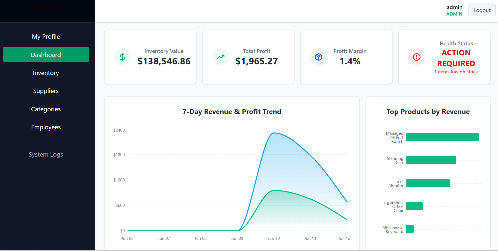
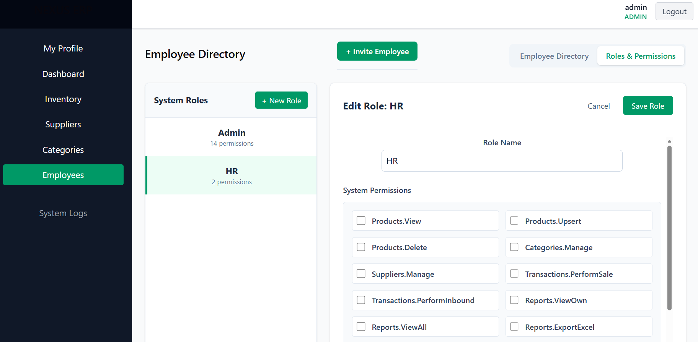
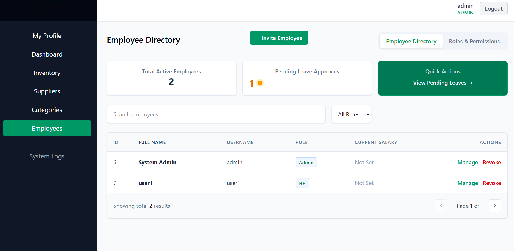
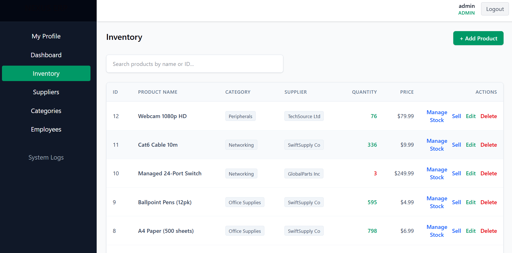
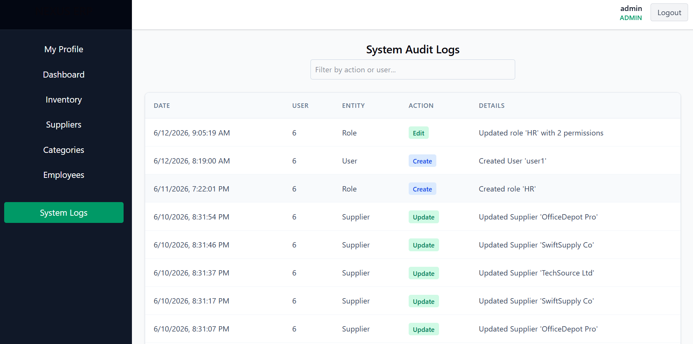

# NEXUS ERP 

**Version:** 2.0.0 | **Architecture:** Secure Service-Oriented Web ERP  

<p align="center">
  
</p>

## System Overview
Nexus ERP is a modular, enterprise-grade resource planning system designed to enforce strict role-based access control (RBAC) and data integrity. Originally conceived as a desktop monolith, the system has been re-architected into a decoupled Web API and React frontend, isolating business logic from data access and presentation.

### Tech Stack
* **Frontend:** React 18 (TypeScript), Tailwind CSS, React Router, Zod.
* **Backend:** ASP.NET Core 8.0 Web API (C#), Entity Framework Core.
* **Database:** SQL Server.
* **Security:** JWT-based Authentication, Cryptographic Claims, Policy-Based Authorization.

---
<p align="center">
  
</p>


## Core Modules & Capabilities

### 1. Identity & Security Management
The system operates on a zero-trust frontend paradigm. Access is governed by strict backend policies mapped to user claims.

<p align="center">
  
</p>

* **Granular RBAC:** Permissions are attached to dynamic system roles.
* **UI Hardening:** The React application conditionally renders layouts, sidebar routes, and action buttons based on verified JWT permissions. Unauthorized navigation attempts are intercepted and forcefully redirected.


### 2. Human Resources Operations
A complete suite for managing personnel, compensation, and operational bandwidth.

* **Secure Onboarding:** Direct invitation pipelines mapping new employees to specific security roles upon creation.
* **Salary Ledger:** Immutable, historical tracking of employee compensation changes over time.
* **Absence Processing:** Dedicated approval pipelines for managing and auditing employee leave requests.

<p align="center">
  
</p>
<p align="center">
  
</p>
---

## System Architecture & Engineering Patterns

Nexus ERP abandons tightly coupled design in favor of a **decoupled, service-oriented architecture (SOA)**. The system is divided into strict boundaries to enforce the separation of concerns, scalability, and security.

### Backend Mechanics (.NET Core)
The backend utilizes the **Service-Repository Pattern**, ensuring business logic is strictly isolated from data access.

* **API Controllers (The Routing Layer):** Controllers are intentionally thin. They receive HTTP requests, enforce Policy-Based Authorization (`[Authorize(Policy = "RequireManageUsers")]`), and delegate payloads.
* **Service Layer (The Business Logic):** Handles cryptographic hashing, business rule validation, and audit logging generation.
* **Repository Layer (The Data Access):** Implements interfaces interacting directly with Entity Framework Core, abstracting raw SQL queries.
* **DTO Boundary:** Domain entities (`User`, `SalaryRecord`) are strictly confined to the backend. Data Transfer Objects (DTOs) act as the translation layer, ensuring sensitive data never leaks to the client.

<p align="center">
  
</p>

### Frontend Mechanics (React + TypeScript)
The UI is engineered for high integrity and fail-safe execution.

* **Type-Safe Contracts:** TypeScript interfaces mirror backend C# DTOs, catching integration bugs at design time.
* **Fail-Fast Validation (Zod):** Complex form data is parsed through Zod validation schemas before HTTP requests are fired, eliminating unnecessary database load from malformed data.
* **Axios Interceptors:** Network requests are centralized. Interceptors automatically inject JWT Bearer tokens and catch `401 Unauthorized` responses globally, triggering a synchronized logout.
* **Permission-Based Routing:** Protected routes parse JWT payload claims in real-time. If a user lacks a specific claim, the React Router physically unmounts the component.

### Database & Audit Protocol
* **Relational Integrity:** Strict Foreign Key constraints bind all entities via Entity Framework Code-First Migrations.
* **The "Black Box" Ledger:** System-critical tables are wired to a `SystemAuditLogs` ledger. Creates, Updates, and Deletes append immutable records detailing the *Actor*, the *Entity*, and the *Timestamp*, providing a forensic trail of all system state changes.

---

## Getting Started

### Prerequisites
* Node.js (v18+)
* .NET 8.0 SDK
* SQL Server

### Backend Setup
```bash
cd NexusERP.Api
dotnet restore
dotnet ef database update
dotnet run